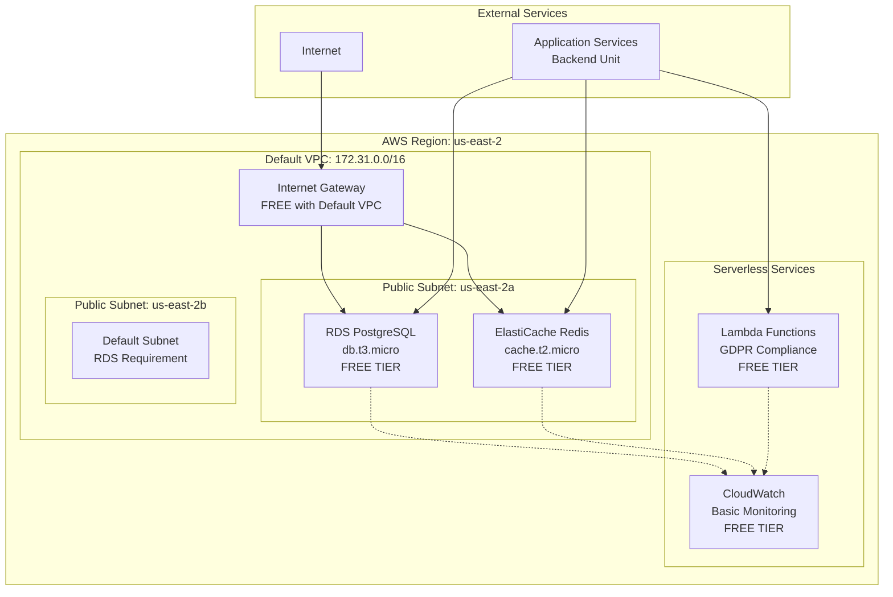
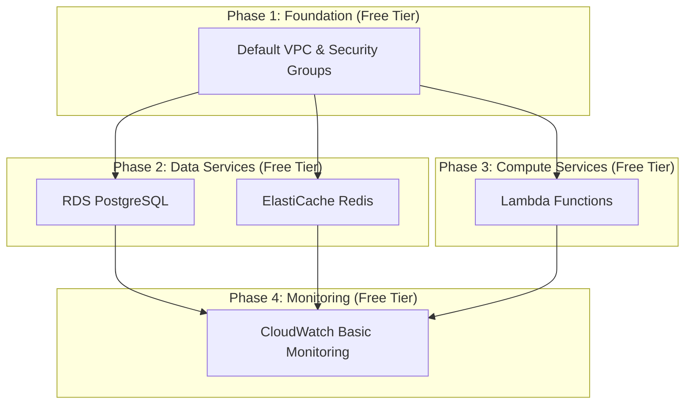

# Database Unit - Deployment Architecture

## Overview

This document defines the deployment architecture for the Database Unit, including the physical deployment topology, service dependencies, deployment procedures, and operational considerations. The architecture is designed for **cost-optimized deployment** in a **single AWS region** with **managed services** to minimize operational overhead.

## Deployment Topology

### Regional Architecture

**Primary Region**: US East 2 (us-east-2) - Ohio
**Deployment Strategy**: Single-region deployment optimized for AWS Free Tier



### Network Architecture

**VPC Configuration**: Default VPC with public subnets (Free Tier optimized)

```yaml
# Network Topology (Free Tier Optimized)
network_topology:
  vpc:
    type: "default"
    cidr: "172.31.0.0/16"  # AWS Default VPC
    dns_hostnames: true
    dns_support: true
    cost: "$0.00"  # Default VPC is free
    
  availability_zones:
    primary: "us-east-2a"
    secondary: "us-east-2b"  # Required for RDS subnet group
    
  subnets:
    default_subnet_2a:
      cidr: "172.31.0.0/20"
      az: "us-east-2a"
      type: "public"
      purpose: "Database services, Cache services"
      cost: "$0.00"  # Default subnets are free
      
    default_subnet_2b:
      cidr: "172.31.16.0/20"
      az: "us-east-2b"
      type: "public"
      purpose: "RDS subnet group requirement"
      cost: "$0.00"  # Default subnets are free
      
  routing:
    default_route_table:
      routes:
        - destination: "0.0.0.0/0"
          target: "Internet Gateway"
          cost: "$0.00"  # Internet Gateway free with default VPC
          
  internet_access:
    inbound: "Internet Gateway (free with default VPC)"
    outbound: "Internet Gateway (free with default VPC)"
    nat_gateway: "Not required - saves $32.40/month"
```

**Security Architecture**: Layered security with security groups and network ACLs

```yaml
# Security Layer Architecture
security_layers:
  network_acls:
    private_subnet_nacl:
      inbound_rules:
        - rule_number: 100
          protocol: "tcp"
          port_range: "5432"
          source: "10.0.0.0/16"
          action: "allow"
        - rule_number: 110
          protocol: "tcp"
          port_range: "6379"
          source: "10.0.0.0/16"
          action: "allow"
        - rule_number: 120
          protocol: "tcp"
          port_range: "443"
          source: "0.0.0.0/0"
          action: "allow"
          
      outbound_rules:
        - rule_number: 100
          protocol: "all"
          port_range: "all"
          destination: "0.0.0.0/0"
          action: "allow"
          
  security_groups:
    database_tier:
      - sg-database-primary (RDS PostgreSQL)
      - sg-rds-proxy (RDS Proxy)
      
    cache_tier:
      - sg-cache-redis (ElastiCache Redis)
      
    compute_tier:
      - sg-lambda-gdpr (Lambda Functions)
      
    application_tier:
      - sg-application (Backend services - external)
```

## Service Dependencies

### Deployment Dependencies

**Dependency Graph**: Services must be deployed in specific order



### Runtime Dependencies

**Service Interdependencies**: Runtime relationships between services

```yaml
# Runtime Dependencies (Free Tier Optimized)
runtime_dependencies:
  rds_postgresql:
    depends_on:
      - default_vpc (networking)
      - default_security_groups (access control)
    provides:
      - database_connectivity
      - data_persistence
    free_tier_benefits:
      - 750_hours_per_month
      - 20gb_storage_included
      - automated_backups_included
      
  elasticache_redis:
    depends_on:
      - default_vpc (networking)
      - default_security_groups (access control)
    provides:
      - caching_services
      - session_storage
    free_tier_benefits:
      - 750_hours_per_month
      - cache_t2_micro_included
      
  lambda_functions:
    depends_on:
      - rds_postgresql (database access)
      - elasticache_redis (cache access)
    provides:
      - gdpr_compliance
      - data_operations
    free_tier_benefits:
      - 1_million_requests_per_month
      - 400000_gb_seconds_compute
      
  cloudwatch:
    depends_on:
      - all_services (monitoring targets)
    provides:
      - basic_monitoring
      - essential_alerting
    free_tier_benefits:
      - 10_custom_metrics
      - 5gb_log_storage
      - 1000_api_requests
```

## Deployment Procedures

### Infrastructure as Code

**Tool**: Terraform for infrastructure provisioning
**Strategy**: Modular deployment with environment separation

```hcl
# Terraform Module Structure
terraform_modules:
  networking:
    path: "modules/networking"
    resources:
      - aws_vpc
      - aws_subnet
      - aws_internet_gateway
      - aws_nat_gateway
      - aws_route_table
      - aws_security_group
      
  database:
    path: "modules/database"
    resources:
      - aws_db_instance
      - aws_db_proxy
      - aws_db_subnet_group
      - aws_db_parameter_group
      
  cache:
    path: "modules/cache"
    resources:
      - aws_elasticache_cluster
      - aws_elasticache_subnet_group
      - aws_elasticache_parameter_group
      
  compute:
    path: "modules/compute"
    resources:
      - aws_lambda_function
      - aws_iam_role
      - aws_iam_policy
      
  monitoring:
    path: "modules/monitoring"
    resources:
      - aws_cloudwatch_dashboard
      - aws_cloudwatch_metric_alarm
      - aws_sns_topic
      
  security:
    path: "modules/security"
    resources:
      - aws_kms_key
      - aws_secretsmanager_secret
      - aws_iam_role
```

### Deployment Pipeline

**CI/CD Pipeline**: Automated deployment with validation

```yaml
# Deployment Pipeline Configuration
deployment_pipeline:
  stages:
    validate:
      steps:
        - terraform_validate
        - terraform_plan
        - security_scan
        - cost_estimation
        
    deploy_foundation:
      steps:
        - deploy_networking
        - deploy_security
        - validate_foundation
        
    deploy_data_services:
      steps:
        - deploy_database
        - deploy_cache
        - validate_connectivity
        
    deploy_access_layer:
      steps:
        - deploy_rds_proxy
        - deploy_lambda_functions
        - validate_access
        
    deploy_monitoring:
      steps:
        - deploy_cloudwatch
        - configure_alarms
        - validate_monitoring
        
    post_deployment:
      steps:
        - run_smoke_tests
        - update_documentation
        - notify_stakeholders
        
  rollback_strategy:
    automatic_rollback:
      triggers:
        - deployment_failure
        - health_check_failure
        - critical_alarm
        
    manual_rollback:
      procedures:
        - terraform_destroy (reverse order)
        - restore_from_backup
        - update_dns_records
```

### Environment Configuration

**Environment Strategy**: Single environment with configuration management

```yaml
# Environment Configuration
environments:
  production:
    region: "us-east-1"
    
    database:
      instance_class: "db.t3.micro"
      allocated_storage: 20
      backup_retention: 7
      multi_az: false
      
    cache:
      node_type: "cache.t3.micro"
      num_nodes: 1
      
    lambda:
      memory_sizes:
        data_export: 512
        data_deletion: 256
        audit_logging: 128
        
    monitoring:
      log_retention: 30  # days
      metric_retention: 15  # months
      
    security:
      encryption_enabled: true
      secrets_rotation: true
      
    cost_controls:
      budget_limit: 100  # USD per month
      auto_scaling_max: 2
      backup_retention_limit: 7  # days
```

## Operational Procedures

### Deployment Checklist

**Pre-Deployment Validation**:

```yaml
# Pre-Deployment Checklist
pre_deployment:
  infrastructure_validation:
    - [ ] Terraform plan reviewed and approved
    - [ ] Security scan passed
    - [ ] Cost estimation within budget
    - [ ] Resource quotas verified
    
  security_validation:
    - [ ] KMS keys configured
    - [ ] Secrets Manager secrets created
    - [ ] IAM roles and policies validated
    - [ ] Security groups reviewed
    
  network_validation:
    - [ ] VPC CIDR ranges verified
    - [ ] Subnet allocations confirmed
    - [ ] Route tables configured
    - [ ] NAT Gateway provisioned
    
  backup_validation:
    - [ ] Backup schedules configured
    - [ ] Cross-region backup enabled
    - [ ] Retention policies set
    - [ ] Recovery procedures documented
```

**Post-Deployment Validation**:

```yaml
# Post-Deployment Checklist
post_deployment:
  connectivity_tests:
    - [ ] RDS PostgreSQL accessible via RDS Proxy
    - [ ] ElastiCache Redis accessible from Lambda
    - [ ] Lambda functions can connect to database
    - [ ] pgvector extension installed and functional
    
  security_tests:
    - [ ] Encryption at rest verified
    - [ ] Encryption in transit verified
    - [ ] Security group rules tested
    - [ ] IAM permissions validated
    
  performance_tests:
    - [ ] Database connection pooling working
    - [ ] Cache hit rates within targets
    - [ ] Vector search performance acceptable
    - [ ] Lambda function execution times normal
    
  monitoring_tests:
    - [ ] CloudWatch metrics flowing
    - [ ] Dashboards displaying data
    - [ ] Alarms configured and tested
    - [ ] Log aggregation working
    
  backup_tests:
    - [ ] Automated backups running
    - [ ] Manual snapshot creation tested
    - [ ] Cross-region backup verified
    - [ ] Restore procedure validated
```

### Maintenance Procedures

**Regular Maintenance Tasks**:

```yaml
# Maintenance Schedule
maintenance_schedule:
  daily:
    - monitor_backup_completion
    - check_alarm_status
    - review_cost_metrics
    
  weekly:
    - review_performance_metrics
    - check_security_group_changes
    - validate_lambda_function_logs
    - test_cache_performance
    
  monthly:
    - perform_backup_restore_test
    - review_and_optimize_costs
    - update_security_patches
    - review_capacity_planning
    
  quarterly:
    - disaster_recovery_drill
    - security_audit
    - performance_optimization_review
    - infrastructure_cost_analysis
```

**Emergency Procedures**:

```yaml
# Emergency Response Procedures
emergency_procedures:
  database_failure:
    immediate_actions:
      - check_rds_proxy_health
      - verify_backup_availability
      - assess_data_loss_risk
      
    recovery_steps:
      - restore_from_latest_backup
      - update_connection_strings
      - validate_data_integrity
      - resume_application_traffic
      
  cache_failure:
    immediate_actions:
      - verify_application_degradation
      - check_cache_cluster_status
      - assess_performance_impact
      
    recovery_steps:
      - restart_cache_cluster
      - warm_cache_with_critical_data
      - monitor_application_performance
      - scale_database_if_needed
      
  network_failure:
    immediate_actions:
      - check_nat_gateway_status
      - verify_security_group_rules
      - assess_connectivity_impact
      
    recovery_steps:
      - recreate_nat_gateway_if_needed
      - validate_route_table_entries
      - test_connectivity_from_all_services
      - monitor_network_performance
```

## Monitoring and Alerting

### Health Monitoring

**Service Health Checks**:

```yaml
# Health Monitoring Configuration
health_monitoring:
  rds_postgresql:
    metrics:
      - cpu_utilization
      - database_connections
      - read_write_latency
      - free_storage_space
    thresholds:
      cpu_critical: 90
      cpu_warning: 70
      connections_critical: 90
      connections_warning: 70
      
  elasticache_redis:
    metrics:
      - cpu_utilization
      - cache_hit_rate
      - current_connections
      - eviction_count
    thresholds:
      cpu_critical: 90
      cpu_warning: 70
      hit_rate_critical: 50
      hit_rate_warning: 70
      
  lambda_functions:
    metrics:
      - duration
      - error_rate
      - throttle_count
      - concurrent_executions
    thresholds:
      duration_critical: 250000  # 250 seconds
      duration_warning: 180000   # 180 seconds
      error_rate_critical: 10
      error_rate_warning: 5
```

### Performance Monitoring

**Performance Dashboards**:

```yaml
# Performance Dashboard Configuration
performance_dashboards:
  database_performance:
    widgets:
      - rds_cpu_memory_utilization
      - database_connection_count
      - query_performance_metrics
      - storage_utilization
      - backup_status
      
  cache_performance:
    widgets:
      - cache_hit_miss_rates
      - cache_memory_utilization
      - cache_operation_latency
      - eviction_patterns
      
  lambda_performance:
    widgets:
      - function_duration_trends
      - error_rate_analysis
      - concurrent_execution_metrics
      - cost_analysis
      
  network_performance:
    widgets:
      - vpc_flow_logs_analysis
      - nat_gateway_utilization
      - security_group_metrics
      - data_transfer_costs
```

## Cost Management

### Cost Optimization

**Cost Monitoring and Controls**:

```yaml
# Cost Management Configuration (Free Tier Optimized)
cost_management:
  free_tier_tracking:
    rds_usage:
      limit: 750  # hours per month
      current_usage: 0
      alert_threshold: 700  # 93% of limit
      
    elasticache_usage:
      limit: 750  # hours per month
      current_usage: 0
      alert_threshold: 700  # 93% of limit
      
    lambda_usage:
      requests_limit: 1000000  # per month
      compute_limit: 400000  # GB-seconds per month
      current_requests: 0
      current_compute: 0
      
    cloudwatch_usage:
      metrics_limit: 10  # custom metrics
      logs_limit: 5  # GB per month
      current_metrics: 2
      current_logs: 0.1  # GB
      
  cost_alerts:
    free_tier_exhaustion:
      - service: "RDS"
        threshold: 93  # percent of free tier used
        action: "email_alert"
      - service: "ElastiCache"
        threshold: 93
        action: "email_alert"
      - service: "Lambda"
        threshold: 90
        action: "email_alert"
        
  post_free_tier_budget:
    monthly_limit: 50  # USD
    alerts:
      - threshold: 25  # 50% of budget
        type: "warning"
      - threshold: 40  # 80% of budget
        type: "critical"
        
  optimization_strategies:
    free_tier_maximization:
      - monitor_usage_patterns
      - optimize_lambda_memory_allocation
      - minimize_custom_cloudwatch_metrics
      - use_default_configurations
      
    post_free_tier_preparation:
      - evaluate_reserved_instances
      - optimize_instance_sizing
      - implement_auto_scaling
      - review_backup_retention_policies
```

This deployment architecture provides a **comprehensive**, **cost-effective**, and **operationally efficient** foundation for deploying and managing the Database Unit infrastructure while maintaining high availability and security standards.
