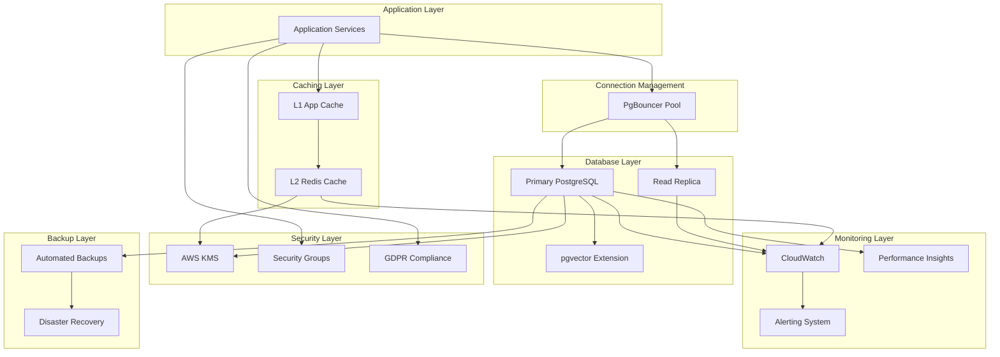

# Database Unit - Logical Components

## Overview

This document defines the logical infrastructure components for the Database Unit, incorporating the NFR design patterns into a cohesive architecture. The design emphasizes **comprehensive monitoring**, **read scaling**, and **automated operational practices** while maintaining cost efficiency.

## Database Infrastructure Components

### Primary Database Cluster

**Component**: PostgreSQL RDS with Read Replicas
**Architecture**: RDS with read replicas for read scaling and backup redundancy

```yaml
# Primary Database Configuration
primary_database:
  component_type: "AWS RDS PostgreSQL"
  instance_class: "db.t3.medium"
  engine_version: "15.4"
  storage:
    type: "gp2"
    size: "100GB"
    auto_scaling: true
    max_size: "500GB"
  
  high_availability:
    multi_az: false  # Cost optimization
    backup_retention: 30
    backup_window: "03:00-04:00"
    maintenance_window: "sun:04:00-sun:05:00"
  
  security:
    encryption_at_rest: true
    encryption_in_transit: true
    kms_key: "aws/rds"
    vpc_security_group: "database-sg"
    subnet_group: "private-subnet-group"
    publicly_accessible: false
  
  monitoring:
    performance_insights: true
    enhanced_monitoring: true
    monitoring_interval: 60
    log_exports: ["postgresql"]

# Read Replica Configuration
read_replicas:
  count: 1
  instance_class: "db.t3.small"  # Smaller for cost optimization
  regions: ["us-east-1"]  # Same region for cost efficiency
  
  configuration:
    auto_minor_version_upgrade: true
    backup_retention: 7  # Shorter retention for replicas
    monitoring_interval: 300  # Less frequent monitoring
    
  scaling:
    auto_scaling: true
    min_replicas: 1
    max_replicas: 2
    cpu_threshold: 70
    connections_threshold: 80
```

**Component Responsibilities**:
- **Primary Database**: All write operations, consistent reads
- **Read Replicas**: Read scaling, backup redundancy, reporting queries
- **Automatic Failover**: Replica promotion in case of primary failure
- **Load Distribution**: Read traffic distribution across replicas

**Integration Points**:
- Connection pooling layer for load balancing
- Application services for read/write separation
- Monitoring systems for health checks
- Backup systems for data protection

### Connection Management Layer

**Component**: PgBouncer with Dynamic Pool Management
**Architecture**: Adaptive connection pooling with load-based scaling

```yaml
# Connection Pooling Configuration
connection_pooling:
  component_type: "PgBouncer"
  deployment: "ECS Service"
  
  pool_configuration:
    default_pool_size: 20
    min_pool_size: 5
    max_pool_size: 50
    reserve_pool_size: 5
    
  adaptive_scaling:
    enabled: true
    scale_up_threshold: 0.8
    scale_down_threshold: 0.3
    scale_up_increment: 5
    scale_down_increment: 2
    evaluation_interval: 60  # seconds
    
  connection_routing:
    write_connections: "primary-database"
    read_connections: "read-replica-pool"
    load_balancing: "round_robin"
    
  health_checks:
    enabled: true
    interval: 30
    timeout: 10
    unhealthy_threshold: 3
    healthy_threshold: 2
    
  monitoring:
    metrics:
      - pool_utilization
      - connection_wait_time
      - active_connections
      - scaling_events
    alerts:
      - high_utilization: ">80%"
      - long_wait_times: ">100ms"
      - scaling_failures: "any"
```

**Component Features**:
- **Dynamic Scaling**: Automatic pool size adjustment based on load
- **Read/Write Separation**: Intelligent connection routing
- **Health Monitoring**: Continuous health checks and failover
- **Performance Optimization**: Connection reuse and transaction pooling

### Vector Storage and Search Component

**Component**: pgvector with Optimized Indexing
**Architecture**: Optimized HNSW indexes with custom parameters and query optimization

```yaml
# Vector Storage Configuration
vector_storage:
  component_type: "pgvector Extension"
  
  index_configuration:
    index_type: "hnsw"
    distance_function: "cosine"
    parameters:
      m: 16  # Connectivity parameter
      ef_construction: 64  # Build-time search
      ef_search: 40  # Query-time search
      
  optimization:
    embedding_dimensions: 1536
    batch_size: 100
    parallel_workers: 4
    maintenance_work_mem: "256MB"
    
  query_optimization:
    distance_threshold: 0.8
    candidate_limit: 50
    result_limit: 20
    query_timeout: 3000  # 3 seconds
    
  monitoring:
    metrics:
      - search_latency_p95
      - index_scan_efficiency
      - query_plan_analysis
      - index_maintenance_overhead
    
    performance_targets:
      search_latency: "<3000ms"
      accuracy: ">90%"
      throughput: ">100 queries/minute"
```

**Search Optimization Features**:
- **Custom Index Parameters**: Tuned for 1536-dimensional embeddings
- **Query Filtering**: Pre-filtering to reduce search space
- **Parallel Processing**: Multi-worker query execution
- **Performance Monitoring**: Continuous optimization tracking

## Caching Infrastructure Components

### Multi-Level Cache Architecture

**Component**: Redis with Application-Level Caching
**Architecture**: Single Redis instance with basic persistence (cost-optimized)

```yaml
# Redis Cache Configuration
redis_cache:
  component_type: "AWS ElastiCache Redis"
  node_type: "cache.t3.micro"
  engine_version: "7.0"
  
  configuration:
    memory: "1GB"
    maxmemory_policy: "allkeys-lru"
    persistence:
      rdb_enabled: true
      rdb_save_frequency: "900 1"  # Save if 1 key changes in 900s
      aof_enabled: false  # Cost optimization
      
  security:
    encryption_at_rest: true
    encryption_in_transit: true
    auth_token: true
    vpc_security_group: "cache-sg"
    subnet_group: "private-subnet-group"
    
  monitoring:
    metrics:
      - cpu_utilization
      - memory_utilization
      - cache_hit_rate
      - eviction_count
      - connection_count
    alerts:
      - cpu_high: ">80%"
      - memory_high: ">85%"
      - hit_rate_low: "<70%"

# Application-Level Cache
application_cache:
  component_type: "In-Memory Cache"
  implementation: "Python Dictionary + LRU"
  
  configuration:
    max_size: "100MB"
    eviction_policy: "LRU"
    ttl_default: 300  # 5 minutes
    
  cache_strategies:
    user_profiles:
      ttl: 3600  # 1 hour
      strategy: "write_through"
      invalidation: "event_driven"
      
    recipes:
      ttl: 1800  # 30 minutes
      strategy: "write_behind"
      invalidation: "time_based"
      
    search_results:
      ttl: 900  # 15 minutes
      strategy: "cache_aside"
      invalidation: "manual"
      
    taste_profiles:
      ttl: 14400  # 4 hours
      strategy: "write_through"
      invalidation: "event_driven"
```

**Cache Architecture Features**:
- **L1 Cache**: Application-level in-memory caching
- **L2 Cache**: Redis distributed caching
- **Strategy Differentiation**: Different strategies per data type
- **Intelligent Invalidation**: Event-driven and time-based invalidation

## Monitoring and Observability Components

### Comprehensive Monitoring Stack

**Component**: CloudWatch with Custom Metrics and Performance Insights
**Architecture**: Comprehensive monitoring with custom metrics and performance insights

```yaml
# Monitoring Infrastructure
monitoring_stack:
  primary_monitoring: "AWS CloudWatch"
  database_insights: "RDS Performance Insights"
  custom_metrics: "CloudWatch Custom Metrics"
  
  cloudwatch_configuration:
    retention_period: 30  # days
    detailed_monitoring: true
    
    metric_filters:
      slow_queries:
        pattern: "[timestamp, duration > 2000]"
        metric_name: "SlowQueryCount"
        
      connection_errors:
        pattern: "connection failed"
        metric_name: "ConnectionErrors"
        
      cache_misses:
        pattern: "cache miss"
        metric_name: "CacheMissRate"
    
    dashboards:
      database_overview:
        widgets:
          - cpu_utilization
          - memory_utilization
          - database_connections
          - read_write_latency
          - iops_utilization
        refresh_interval: 30  # seconds
        
      cache_performance:
        widgets:
          - cache_hit_rate
          - cache_memory_usage
          - eviction_rate
          - operation_latency
        refresh_interval: 60  # seconds
        
      vector_search_analytics:
        widgets:
          - search_latency_distribution
          - search_accuracy_metrics
          - index_performance
          - query_throughput
        refresh_interval: 120  # seconds

# Performance Insights Configuration
performance_insights:
  enabled: true
  retention_period: 7  # days (free tier)
  
  key_metrics:
    - top_sql_statements
    - database_load_by_waits
    - connection_analysis
    - lock_contention
    
  custom_dimensions:
    - application_name
    - user_type
    - query_type
    - data_source

# Alerting Configuration
alerting_system:
  notification_channels:
    email:
      addresses: ["admin@recipeapp.com"]
      severity_levels: ["critical", "high"]
      
    slack:
      webhook_url: "${SLACK_WEBHOOK_URL}"
      channel: "#database-alerts"
      severity_levels: ["critical", "high", "medium"]
      
  alert_rules:
    database_cpu_high:
      metric: "CPUUtilization"
      threshold: 70
      duration: 300  # 5 minutes
      severity: "high"
      
    connection_pool_exhausted:
      metric: "DatabaseConnections"
      threshold: 45  # 90% of 50 max
      duration: 180  # 3 minutes
      severity: "critical"
      
    cache_hit_rate_low:
      metric: "CacheHitRate"
      threshold: 70
      comparison: "LessThanThreshold"
      duration: 600  # 10 minutes
      severity: "medium"
      
    vector_search_slow:
      metric: "VectorSearchLatencyP95"
      threshold: 3000  # 3 seconds
      duration: 300  # 5 minutes
      severity: "high"
```

**Monitoring Features**:
- **Real-time Dashboards**: Multi-layered performance visualization
- **Proactive Alerting**: Multi-channel notification system
- **Performance Insights**: Deep database performance analysis
- **Custom Metrics**: Application-specific monitoring

## Backup and Disaster Recovery Components

### Multi-Tier Backup Infrastructure

**Component**: Automated Backup with Testing and Validation
**Architecture**: Multi-tier backup strategy with automated testing and validation

```yaml
# Backup Infrastructure
backup_system:
  component_type: "AWS RDS Automated Backup + Custom Scripts"
  
  primary_backups:
    type: "automated_snapshot"
    frequency: "daily"
    retention: 30  # days
    window: "03:00-04:00"
    encryption: true
    
  secondary_backups:
    type: "manual_snapshot"
    frequency: "weekly"
    retention: 12  # weeks
    cross_region: false  # Cost optimization
    
  point_in_time_recovery:
    enabled: true
    retention: 7  # days
    
  backup_validation:
    frequency: "monthly"
    validation_types:
      - restore_test
      - data_integrity_check
      - performance_validation
      - recovery_time_measurement
    
    test_environment:
      instance_class: "db.t3.small"
      storage_type: "gp2"
      temporary: true
      auto_cleanup: true
      
  disaster_recovery:
    rto_target: 4  # hours
    rpo_target: 24  # hours
    
    recovery_procedures:
      automated_steps:
        - backup_identification
        - instance_provisioning
        - data_restoration
        - connection_validation
        
      manual_steps:
        - application_configuration
        - dns_updates
        - monitoring_setup
        - user_notification
        
    testing_schedule:
      frequency: "quarterly"
      scope: "full_disaster_recovery"
      documentation: "dr_runbook.md"

# Backup Monitoring
backup_monitoring:
  metrics:
    - backup_completion_status
    - backup_duration
    - backup_size
    - restoration_time
    
  alerts:
    backup_failed:
      severity: "critical"
      notification: "immediate"
      
    backup_duration_long:
      threshold: 120  # minutes
      severity: "medium"
      
    restoration_test_failed:
      severity: "high"
      escalation: "immediate"
```

**Backup Features**:
- **Automated Scheduling**: Daily and weekly backup automation
- **Validation Testing**: Monthly restore and integrity testing
- **Cross-Region Protection**: Optional cross-region backup capability
- **Recovery Automation**: Semi-automated disaster recovery procedures

## Security and Compliance Components

### Data Protection Infrastructure

**Component**: AWS KMS with Database-Level Encryption
**Architecture**: Database-level encryption with AWS managed keys

```yaml
# Security Infrastructure
security_components:
  encryption_management:
    component_type: "AWS KMS"
    
    key_configuration:
      rds_key:
        key_id: "aws/rds"
        rotation: "automatic"
        usage: "database_encryption"
        
      elasticache_key:
        key_id: "aws/elasticache"
        rotation: "automatic"
        usage: "cache_encryption"
        
      backup_key:
        key_id: "aws/rds"
        rotation: "automatic"
        usage: "backup_encryption"
    
    access_policies:
      database_service:
        permissions: ["encrypt", "decrypt", "generate_data_key"]
        resources: ["rds_key", "backup_key"]
        
      cache_service:
        permissions: ["encrypt", "decrypt"]
        resources: ["elasticache_key"]
        
      backup_service:
        permissions: ["encrypt", "decrypt", "generate_data_key"]
        resources: ["backup_key"]

# Network Security
network_security:
  vpc_configuration:
    vpc_id: "vpc-database"
    private_subnets: ["subnet-db-1", "subnet-db-2"]
    
  security_groups:
    database_sg:
      ingress_rules:
        - protocol: "tcp"
          port: 5432
          source: "application-sg"
          description: "PostgreSQL access from application"
          
        - protocol: "tcp"
          port: 6432
          source: "application-sg"
          description: "PgBouncer access from application"
          
    cache_sg:
      ingress_rules:
        - protocol: "tcp"
          port: 6379
          source: "application-sg"
          description: "Redis access from application"
          
  connection_security:
    tls_version: "1.2"
    certificate_verification: "required"
    connection_timeout: 30
```

### GDPR Compliance Infrastructure

**Component**: Automated Compliance with Audit Trails
**Architecture**: Automated compliance with API-driven data operations and audit trails

```yaml
# GDPR Compliance System
gdpr_compliance:
  component_type: "Custom Application Service"
  deployment: "ECS Service"
  
  data_operations:
    export_service:
      formats: ["json", "csv"]
      encryption: true
      retention: 30  # days
      delivery: "secure_download"
      
    deletion_service:
      cascade_deletes: true
      verification: true
      audit_logging: true
      irreversible: true
      
    consent_management:
      tracking: true
      versioning: true
      withdrawal: true
      granular_permissions: true
      
  audit_system:
    component_type: "Database Audit Logging"
    
    audit_events:
      - user_data_access
      - data_modifications
      - export_requests
      - deletion_requests
      - consent_changes
      
    audit_storage:
      table: "audit_logs"
      retention: 7  # years
      encryption: true
      immutable: true
      
    compliance_reporting:
      frequency: "monthly"
      format: "automated_report"
      metrics:
        - data_export_requests
        - data_deletion_requests
        - consent_withdrawal_rate
        - audit_log_integrity
```

## Component Integration Architecture

### Integration Overview



### Component Dependencies

**Startup Dependencies**:
1. **Security Components** (KMS, Security Groups)
2. **Database Components** (Primary DB, Read Replicas)
3. **Caching Components** (Redis, Application Cache)
4. **Connection Management** (PgBouncer)
5. **Monitoring Components** (CloudWatch, Alerting)
6. **Compliance Components** (GDPR Services)

**Runtime Dependencies**:
- Connection pooling depends on database health
- Caching depends on Redis availability
- Monitoring depends on all component health
- GDPR compliance depends on audit logging
- Backup validation depends on test environment

This comprehensive logical component architecture ensures the Database Unit meets all NFR requirements while providing a scalable, resilient, and compliant foundation for the recipe book application.
