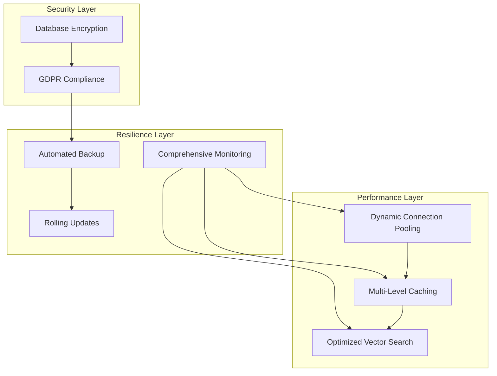

# Database Unit - NFR Design Patterns

## Overview

This document defines the non-functional design patterns for the Database Unit, incorporating scalability, performance, resilience, and security patterns based on the comprehensive NFR requirements assessment. The design emphasizes **adaptive resource management**, **multi-level optimization**, and **comprehensive operational practices**.

## Performance and Scalability Patterns

### Dynamic Connection Pooling Pattern

**Pattern**: Adaptive Connection Pool Management
**Implementation**: Dynamic connection pooling with adaptive pool sizing based on load

```python
# Connection Pool Configuration
class AdaptiveConnectionPool:
    def __init__(self):
        self.min_connections = 5
        self.max_connections = 50
        self.current_pool_size = 10
        self.load_threshold_high = 0.8
        self.load_threshold_low = 0.3
        self.scale_up_increment = 5
        self.scale_down_increment = 2
        
    def adjust_pool_size(self, current_load, active_connections):
        utilization = active_connections / self.current_pool_size
        
        if utilization > self.load_threshold_high:
            # Scale up pool size
            new_size = min(
                self.current_pool_size + self.scale_up_increment,
                self.max_connections
            )
            self.scale_pool(new_size)
            
        elif utilization < self.load_threshold_low:
            # Scale down pool size
            new_size = max(
                self.current_pool_size - self.scale_down_increment,
                self.min_connections
            )
            self.scale_pool(new_size)
```

**Benefits**:
- Optimizes resource utilization based on actual load
- Reduces connection overhead during low-traffic periods
- Automatically scales to handle traffic spikes
- Maintains cost efficiency while ensuring performance

**Monitoring Metrics**:
- Connection pool utilization percentage
- Average connection wait time
- Pool scaling events frequency
- Connection establishment latency

### Multi-Level Caching Pattern

**Pattern**: Hierarchical Cache Architecture
**Implementation**: Multi-level caching with different strategies for different data types

```python
# Multi-Level Cache Architecture
class MultiLevelCache:
    def __init__(self):
        self.l1_cache = {}  # In-memory application cache
        self.l2_cache = RedisCache()  # Redis distributed cache
        self.cache_strategies = {
            'user_profiles': {
                'ttl': 3600,  # 1 hour
                'strategy': 'write_through',
                'invalidation': 'event_driven'
            },
            'recipes': {
                'ttl': 1800,  # 30 minutes
                'strategy': 'write_behind',
                'invalidation': 'time_based'
            },
            'search_results': {
                'ttl': 900,  # 15 minutes
                'strategy': 'cache_aside',
                'invalidation': 'manual'
            },
            'taste_profiles': {
                'ttl': 14400,  # 4 hours
                'strategy': 'write_through',
                'invalidation': 'event_driven'
            }
        }
    
    def get(self, key, data_type):
        # L1 Cache check
        if key in self.l1_cache:
            return self.l1_cache[key]
        
        # L2 Cache check
        value = self.l2_cache.get(key)
        if value:
            # Promote to L1 cache
            self.l1_cache[key] = value
            return value
        
        return None
    
    def set(self, key, value, data_type):
        strategy = self.cache_strategies[data_type]
        
        # Set in both levels based on strategy
        self.l1_cache[key] = value
        self.l2_cache.set(key, value, ttl=strategy['ttl'])
        
        # Apply invalidation strategy
        self.apply_invalidation_strategy(key, data_type, strategy)
```

**Cache Strategies by Data Type**:
- **User Profiles**: Write-through with event-driven invalidation
- **Recipes**: Write-behind with time-based invalidation
- **Search Results**: Cache-aside with manual invalidation
- **Taste Profiles**: Write-through with event-driven invalidation

**Performance Targets**:
- Overall cache hit rate: >70%
- L1 cache hit rate: >40%
- L2 cache hit rate: >85%
- Cache response time: <10ms

### Optimized Vector Search Pattern

**Pattern**: HNSW Index Optimization with Query Tuning
**Implementation**: Optimized HNSW indexes with custom parameters and query optimization

```sql
-- Optimized Vector Index Configuration
CREATE INDEX idx_recipe_embeddings_optimized 
ON recipe_embeddings 
USING hnsw (embedding vector_cosine_ops) 
WITH (
    m = 16,                    -- Connectivity parameter (balanced accuracy/speed)
    ef_construction = 64       -- Build-time search parameter
);

-- Runtime Query Optimization
SET hnsw.ef_search = 40;       -- Query-time search parameter

-- Optimized Vector Search Query Pattern
WITH vector_candidates AS (
    SELECT 
        recipe_id,
        embedding <=> %s::vector AS distance
    FROM recipe_embeddings
    WHERE embedding <=> %s::vector < 0.8  -- Distance threshold filter
    ORDER BY embedding <=> %s::vector
    LIMIT 50
),
recipe_details AS (
    SELECT 
        r.id,
        r.title,
        r.cuisine_type,
        r.difficulty_level,
        vc.distance
    FROM vector_candidates vc
    JOIN recipes r ON r.id = vc.recipe_id
    WHERE r.ai_processed = true
)
SELECT * FROM recipe_details
ORDER BY distance
LIMIT 20;
```

**Optimization Techniques**:
- **Index Parameters**: Tuned m=16, ef_construction=64 for 1536-dimensional embeddings
- **Query Filtering**: Pre-filter with distance threshold to reduce search space
- **Result Limiting**: Limit vector search to 50 candidates, then apply business logic
- **Index Maintenance**: Periodic index statistics updates and optimization

**Performance Monitoring**:
- Vector search query execution time
- Index scan efficiency metrics
- Query plan analysis and optimization
- Index maintenance overhead tracking

## Resilience and Availability Patterns

### Automated Backup and Recovery Pattern

**Pattern**: Comprehensive Backup Strategy with Automated Testing
**Implementation**: Automated backups with documented recovery procedures and testing

```yaml
# Backup Strategy Configuration
backup_strategy:
  primary_backups:
    frequency: daily
    retention: 30_days
    window: "03:00-04:00 UTC"
    type: automated_snapshot
    
  secondary_backups:
    frequency: weekly
    retention: 12_weeks
    type: cross_region_copy
    
  point_in_time_recovery:
    enabled: true
    retention: 7_days
    
  backup_testing:
    frequency: monthly
    test_types:
      - restore_validation
      - data_integrity_check
      - recovery_time_measurement
    
  recovery_procedures:
    rto_target: "4 hours"
    rpo_target: "24 hours"
    documentation: "recovery_runbook.md"
    automation_level: "semi_automated"
```

**Recovery Procedures**:
1. **Automated Detection**: Monitor backup completion and integrity
2. **Recovery Validation**: Monthly automated restore testing
3. **Documentation**: Comprehensive recovery runbooks
4. **Testing Schedule**: Quarterly disaster recovery drills

### Rolling Update Pattern

**Pattern**: Graceful Maintenance with Connection Draining
**Implementation**: Rolling updates with connection draining and graceful shutdown

```python
# Rolling Update Implementation
class RollingUpdateManager:
    def __init__(self):
        self.connection_pool = AdaptiveConnectionPool()
        self.maintenance_mode = False
        self.drain_timeout = 300  # 5 minutes
        
    def initiate_maintenance(self):
        """Start maintenance mode with connection draining"""
        self.maintenance_mode = True
        
        # Stop accepting new connections
        self.connection_pool.stop_new_connections()
        
        # Wait for existing connections to complete
        self.drain_connections()
        
        # Proceed with maintenance
        return self.perform_maintenance()
    
    def drain_connections(self):
        """Gracefully drain existing connections"""
        start_time = time.time()
        
        while self.connection_pool.active_connections > 0:
            if time.time() - start_time > self.drain_timeout:
                # Force close remaining connections
                self.connection_pool.force_close_all()
                break
            
            time.sleep(5)  # Check every 5 seconds
    
    def perform_maintenance(self):
        """Execute maintenance tasks"""
        tasks = [
            self.update_database_schema,
            self.optimize_indexes,
            self.update_statistics,
            self.validate_integrity
        ]
        
        for task in tasks:
            if not task():
                return self.rollback_maintenance()
        
        return self.complete_maintenance()
```

**Maintenance Procedures**:
- **Pre-maintenance**: Health checks and backup verification
- **Connection Draining**: Graceful connection termination
- **Schema Updates**: Automated migration execution
- **Post-maintenance**: Validation and monitoring restoration

### Comprehensive Monitoring Pattern

**Pattern**: Multi-Channel Monitoring with Dashboard Visualization
**Implementation**: Comprehensive monitoring with dashboard visualization and multi-channel alerting

```python
# Monitoring Configuration
monitoring_config = {
    'metrics': {
        'database_performance': {
            'cpu_utilization': {'threshold': 70, 'duration': '5m'},
            'memory_utilization': {'threshold': 80, 'duration': '5m'},
            'connection_count': {'threshold': 40, 'duration': '3m'},
            'query_latency_p95': {'threshold': 500, 'duration': '2m'},
            'slow_query_count': {'threshold': 10, 'duration': '5m'}
        },
        'cache_performance': {
            'hit_rate': {'threshold': 70, 'direction': 'below', 'duration': '10m'},
            'eviction_rate': {'threshold': 100, 'duration': '5m'},
            'memory_utilization': {'threshold': 85, 'duration': '5m'}
        },
        'vector_search': {
            'search_latency_p95': {'threshold': 3000, 'duration': '5m'},
            'search_accuracy': {'threshold': 90, 'direction': 'below', 'duration': '10m'},
            'index_efficiency': {'threshold': 80, 'direction': 'below', 'duration': '15m'}
        }
    },
    'alerting': {
        'channels': ['email', 'slack', 'pagerduty'],
        'escalation': {
            'level_1': {'delay': '5m', 'channels': ['slack']},
            'level_2': {'delay': '15m', 'channels': ['email', 'slack']},
            'level_3': {'delay': '30m', 'channels': ['pagerduty']}
        }
    },
    'dashboards': {
        'database_overview': {
            'metrics': ['cpu', 'memory', 'connections', 'latency'],
            'refresh_interval': '30s'
        },
        'cache_performance': {
            'metrics': ['hit_rate', 'evictions', 'memory', 'operations'],
            'refresh_interval': '1m'
        },
        'vector_search_analytics': {
            'metrics': ['search_latency', 'accuracy', 'throughput'],
            'refresh_interval': '2m'
        }
    }
}
```

**Monitoring Components**:
- **Real-time Dashboards**: Performance metrics visualization
- **Proactive Alerting**: Multi-level escalation system
- **Custom Metrics**: Application-specific performance indicators
- **Trend Analysis**: Historical performance tracking

## Security and Compliance Patterns

### Database-Level Encryption Pattern

**Pattern**: AWS Managed Encryption with Key Rotation
**Implementation**: Database-level encryption with AWS managed keys

```yaml
# Encryption Configuration
encryption_config:
  rds_encryption:
    enabled: true
    kms_key: "aws/rds"
    key_rotation: automatic
    
  elasticache_encryption:
    at_rest: true
    in_transit: true
    kms_key: "aws/elasticache"
    
  connection_encryption:
    tls_version: "1.2"
    certificate_verification: required
    
  backup_encryption:
    enabled: true
    kms_key: "aws/rds"
    cross_region: true
```

**Security Controls**:
- **Data at Rest**: AES-256 encryption with AWS KMS
- **Data in Transit**: TLS 1.2+ for all connections
- **Key Management**: AWS managed keys with automatic rotation
- **Access Control**: IAM-based key access policies

### Automated GDPR Compliance Pattern

**Pattern**: API-Driven Data Operations with Audit Trails
**Implementation**: Automated compliance with API-driven data operations and audit trails

```python
# GDPR Compliance Implementation
class GDPRComplianceManager:
    def __init__(self):
        self.audit_logger = AuditLogger()
        self.data_export_service = DataExportService()
        self.data_deletion_service = DataDeletionService()
    
    def export_user_data(self, user_id, export_format='json'):
        """Export all user data for GDPR compliance"""
        self.audit_logger.log_gdpr_action(
            user_id=user_id,
            action='data_export_requested',
            timestamp=datetime.utcnow()
        )
        
        user_data = {
            'user_profile': self.get_user_profile(user_id),
            'recipes': self.get_user_recipes(user_id),
            'taste_profile': self.get_taste_profile(user_id),
            'audit_logs': self.get_user_audit_logs(user_id)
        }
        
        export_file = self.data_export_service.create_export(
            user_data, export_format
        )
        
        self.audit_logger.log_gdpr_action(
            user_id=user_id,
            action='data_export_completed',
            export_file=export_file,
            timestamp=datetime.utcnow()
        )
        
        return export_file
    
    def delete_user_data(self, user_id):
        """Complete user data deletion for GDPR compliance"""
        self.audit_logger.log_gdpr_action(
            user_id=user_id,
            action='data_deletion_requested',
            timestamp=datetime.utcnow()
        )
        
        # Delete in dependency order
        deletion_order = [
            'user_sessions',
            'data_export_requests',
            'parsed_ingredients',
            'recipe_embeddings',
            'recipes',
            'user_taste_profiles',
            'users'
        ]
        
        for table in deletion_order:
            self.data_deletion_service.delete_user_data(table, user_id)
        
        self.audit_logger.log_gdpr_action(
            user_id=user_id,
            action='data_deletion_completed',
            timestamp=datetime.utcnow()
        )
```

**GDPR Compliance Features**:
- **Data Export**: Automated user data export in JSON/CSV formats
- **Data Deletion**: Complete user data purging with cascade deletes
- **Audit Logging**: Comprehensive audit trail for all GDPR operations
- **Consent Management**: Consent tracking and version management

## Pattern Integration and Orchestration

### Pattern Coordination

**Integration Strategy**: All patterns work together to provide a cohesive, high-performance, and compliant database infrastructure:

1. **Performance Patterns** optimize resource utilization and response times
2. **Resilience Patterns** ensure high availability and data protection
3. **Security Patterns** protect data and ensure regulatory compliance
4. **Monitoring Patterns** provide visibility and proactive issue detection

### Pattern Dependencies



### Pattern Validation

**Testing Strategy**: Each pattern includes specific validation criteria:
- **Performance Patterns**: Load testing and benchmark validation
- **Resilience Patterns**: Failure simulation and recovery testing
- **Security Patterns**: Security scanning and compliance auditing
- **Integration Testing**: End-to-end pattern interaction validation

This comprehensive set of NFR design patterns ensures the Database Unit meets all performance, scalability, resilience, and security requirements while maintaining operational excellence and cost efficiency.
