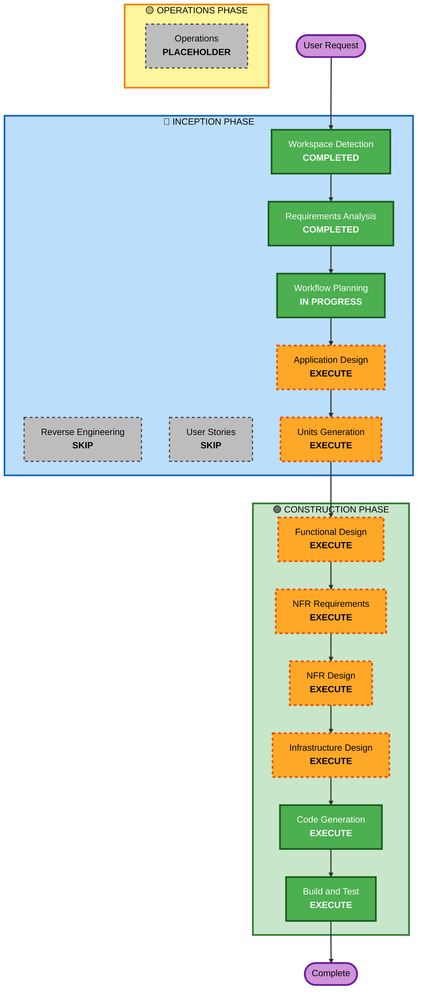

# Execution Plan

## Detailed Analysis Summary

### Change Impact Assessment
- **User-facing changes**: Yes - Complete new user interface for recipe management, search, and AI-powered recommendations
- **Structural changes**: Yes - Full-stack architecture with Next.js frontend, FastAPI backend, PostgreSQL with pgvector, Redis caching
- **Data model changes**: Yes - New database schemas for users, recipes, embeddings, taste profiles, and authentication
- **API changes**: Yes - Complete new RESTful API design for recipe CRUD, search, recommendations, and user management
- **NFR impact**: Yes - Performance (1-3s recommendations), security (GDPR), scalability (hundreds of users), cost optimization (AI usage)

### Risk Assessment
- **Risk Level**: High
- **Rollback Complexity**: N/A (Greenfield project)
- **Testing Complexity**: Complex - AI integration testing, multi-service integration, performance validation, cost monitoring

## Workflow Visualization

## Phases to Execute

### 🔵 INCEPTION PHASE
- [x] Workspace Detection (COMPLETED)
- [x] Reverse Engineering (SKIPPED - Greenfield project)
- [x] Requirements Analysis (COMPLETED)
- [x] User Stories (SKIPPED - Requirements comprehensive and clear)
- [x] Workflow Planning (IN PROGRESS)
- [ ] Application Design - EXECUTE
  - **Rationale**: Complex multi-service architecture requiring component identification, service layer design, and integration patterns
- [ ] Units Generation - EXECUTE
  - **Rationale**: System requires decomposition into multiple units: Frontend (Next.js), Backend API (FastAPI), AI Service, Database, Infrastructure

### 🟢 CONSTRUCTION PHASE
- [ ] Functional Design - EXECUTE (per unit)
  - **Rationale**: Complex business logic for AI recommendations, ingredient parsing, taste profiles, and semantic search
- [ ] NFR Requirements - EXECUTE (per unit)
  - **Rationale**: Significant performance, security, scalability, and cost optimization requirements
- [ ] NFR Design - EXECUTE (per unit)
  - **Rationale**: Specific design patterns needed for caching, async processing, cost optimization, and security
- [ ] Infrastructure Design - EXECUTE (per unit)
  - **Rationale**: Multi-cloud deployment with AWS services and Vercel requiring detailed infrastructure planning
- [ ] Code Generation - EXECUTE (ALWAYS, per unit)
  - **Rationale**: Implementation of all components and services
- [ ] Build and Test - EXECUTE (ALWAYS)
  - **Rationale**: Integration testing, performance validation, and AI functionality verification

### 🟡 OPERATIONS PHASE
- [ ] Operations - PLACEHOLDER
  - **Rationale**: Future deployment and monitoring workflows

## Estimated Timeline
- **Total Phases**: 8 execution phases
- **Estimated Duration**: 2-3 weeks for full implementation
- **Critical Path**: AI integration and recommendation system development

## Success Criteria
- **Primary Goal**: Functional AI-powered recipe recommendation system
- **Key Deliverables**: 
  - Working Next.js frontend with recipe management
  - FastAPI backend with AI integration
  - PostgreSQL database with pgvector for semantic search
  - Redis caching layer
  - AWS deployment infrastructure
  - Comprehensive test suite
- **Quality Gates**: 
  - All functional requirements met
  - Performance targets achieved (1-3s recommendations)
  - GDPR compliance implemented
  - Cost optimization validated
  - Security requirements satisfied
